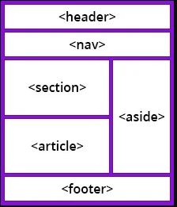

# HTML CSS Interview Questions
### Note

<details>
  <summary> Resources : </summary>
  Resources of HTML Questions:
  
    1. Top 15 HTML Interview questionns.
    2. Programming Hero Interview questions video.                                                                                                                                                                                        |
</details>

### Table of Contents

<details open>
  <summary> Hide/Show Table of contents</summary>

  | No. | Questions                                   |
  | --- | ----------------------------------------------------------------------------------------------------------------------------------------------------------------------------|
  |     | **Core HTML**                                                                                                                                                                                                                   |
| 1  *** | [What are HTML & HTML5 ? Difference between HTML & HTML5. ](#what-is-HTML)                                                                                                                                                                                                 |
| 2  ***  | [What is Semantic in HTML? Why should we use semantic tags  instead of using  div? ](#what-is-Semantic-in-HTML)                                                                                                                                                                                                 |
| 3  ***  | [Difference between HTML element and HTML tag. ](#Difference-between-HTML-element-and-HTML-tag)                                                                                                                                                                                                 |
| 4  ***  | [When to use inline elements & when to use block elements? give example ? ](#When-to-use-inline-elements)                                                                                                                                                                                                 |
| 5  **  | [What is a Tag in HTML? Also, Can you separate sections of texts in HTML? ](#What-is-a-Tag-in-HTML)                                                                                                                                                                                                 |
| 6  ***  | [What are Attributes in HTML?](#What-are-Attributes-in-HTML)                                                                                                                                                                                                 |
| 7  **  | [What is an Anchor tag in HTML?](#What-is-an-Anchor-tag-in-HTML)                                                                                                                                                                                                 |
| 8  **  | [What are Lists in HTML?Define the list types in HTML.](#What-are-Lists-in-HTML)                                                                                                                                                                                                 |
| 9  *** | [Define HTML Layout.](#Define-HTML-Layout)                                                                                                                                                                                                 |
| 10  ** | [What is the Use of Comments in HTML?](#What-is-the-Use-of-Comments-in-HTML)                                                                                                                                                                                                 |
</details>


<!--   Answers
================= -->

## Core HTML
1.  ### What is HTML?

    HTML (Hypertext Markup Language) is a standard markup language **used for creating the structure and content of web pages.** 

    HTML is the backbone of the World Wide Web, **providing a way to structure and present information** on the internet.

    It consists of a set of tags and elements like headings, paragraphs, images, links, and other components of a webpage. 

    <details>
      <summary> Definition of HyperText  </summary>
      Hypertext refers to the capability of linking and connecting different pieces of information or documents through hyperlinks, it enables users to navigate between web pages by clicking on text, images, or other elements.
    </details>
    <details>
      <summary> Definition of Markup  </summary>
      Markup in HTML is the use of angle brackets tags (< > </>) to format and structure content for web browsers.
    </details>

    **HTML Versions at a  glance**
    

    ### What is HTML5?
    HTML5 is the **fifth and latest version** of the Hypertext Markup Language (HTML), which is the standard markup language used for creating web pages and web applications.

    It was developed by the World Wide Web Consortium (W3C) and the Web Hypertext Application Technology Working Group (WHATWG)

    HTML5 introduces new elements, attributes, and APIs (Application Programming Interfaces) that enhance the capabilities of web development.
    
    ### HTML vs HTML5  
    - **Simplified Doctype** ===  ``` <!DOCTYPE html>```
    - **Different Meta** === charset, viewport, author
    
        ```jsx
        <meta charset="UTF-8">
        <meta name="viewport" content="width=device-width, initial-scale=1.0">
        <meta name="author" content="John Doe">
        ```
    
    - **New Element tags** like  audio, video, embed, details, datalist, figure, command, canvas (try to know these tags’ short description)
    - **New input tags**: date, datetime-local, datetime, email, month, number, range
    - **More Semantic tags** :   header, nav, main, section, article, aside, footer, em, strong etc.
    - **New terminology**: Semantic 
    

    **[⬆ Back to Top](#table-of-contents)**

    

2.  ### What is Semantic in HTML?
    ### Why should we use semantic tags  instead of using  div??

       [PH Interview video-1](https://www.facebook.com/100070028615565/videos/1666272797114745)

      Semantic means **meaningful**. A semantic tag in HTML is a tag that carries meaning about the structure and content of the web page, providing information about the type of content enclosed within the tags.

      **Why should We use semantic tags in html?**  
      - **Accessibility:** Helps screen readers (individuals with disabilities) and other assistive technologies **(Screen Magnifiers, Braille displays, Speech Recognition Software)** interpret content.
      - **SEO Friendly:** Improves search engine rankings by providing meaningful structure.
      - **Code Readability:** Makes code more **readable and maintainable** for developers.
  
        <details>
          <summary> Examples of some semantic tags include:  </summary>
          
          1. **`<header>`**: Represents the header of a section or a page.
          2. **`<nav>`**: Defines a navigation menu.
          3. **`<main>`**: Represents the main content of a document.
          4. **`<article>`**: Represents a self-contained piece of content, such as a news article.
          5. **`<section>`**: Defines a section in a document.
          6. **`<aside>`**: Represents content that is tangentially related to the content around it.
          7. **`<footer>`**: Represents the footer of a section or a page.


          1. **`<strong>`**: Represents strong **importance or seriousness.**
          2. **`<mark>`**: Represents text **highlighted f**or reference or notation purposes.
          3. **`<figure>`**: Represents any content that is referenced from the main content, such as images or diagrams.
          4. **`<figcaption>`**: Represents a caption or legend for a **`<figure>`** element.
          5. **`<address>`**: Represents contact information for the nearest **`<article>`** or **`<body>`** ancestor.

          1. **`<cite>`**: Represents the title of a creative work or the name of its author.
          2. **`<abbr>`**: Represents an abbreviation or acronym.
          3. **`<details>`**: Represents a disclosure widget from which the user can obtain additional information or controls.
          4. **`<summary>`**: Defines a summary or caption for the content of a **`<details>`** element.
          5. **`<time>`**: Represents a specific period in time.
        </details>
        <details>
          <summary>Examples of some non-semantic tags</summary>
          
          1. **`<div></div>`**
          2. **`<span></span>`**
          3. **`<b></b>`**
          4. **`<i></i>`**
          5. **`<strike></strike>`**
        </details>

        **Semantic tags for structure**
        
        

      
    **[⬆ Back to Top](#table-of-contents)**
    
    
3.  ### Difference between HTML element and HTML tag.

       [PH Interview video-1](https://www.facebook.com/100070028615565/videos/1666272797114745)

    The key difference between HTML elements and tags is that an **HTML element** consists of the opening tag, content, and closing tag, while an **HTML tag** is the specific syntax used to define the beginning and end of an element.


    **[⬆ Back to Top](#table-of-contents)**

    

4.  ### When to use inline elements 
    ### & when to use block elements? Give Example

      [PH Interview video-1](https://www.facebook.com/100070028615565/videos/1666272797114745)

      **Block element** Takes full width. on the other hand **Inline Element** Takes required width


    **[⬆ Back to Top](#table-of-contents)**


5.  ### What is a Tag in HTML?
    HTML tags are essential components for specifying various types of content, such as text, images, links, and multimedia etc.
    Tags are enclosed within angle brackets `< >` and typically come in pairs: an opening tag and a closing tag.
   
    ### Also, Can you separate sections of texts in HTML?
    Yes, in HTML, I can separate sections of text using various elements such as paragraphs `</br> `<p>`, headings `<h1> to <h6>`, divs `<div>`, and spans `<span>`. These elements help structure and organize content within a  webpage.

    **[⬆ Back to Top](#table-of-contents)**


6. ### What are Attributes in HTML?
    HTML attributes provide **extra information about HTML elements**. They modify element behaviour or appearance and are placed within the opening tag. 

    Attributes consist of a name and a value, separated by an equal sign.

    **[⬆ Back to Top](#table-of-contents)**
   
   
7. ### What is an Anchor tag in HTML?
    An anchor tag `<a>` in HTML creates hyperlinks allowing users to navigate between web pages by clicking. It requires an `href` attribute specifying the URL.

    **[⬆ Back to Top](#table-of-contents)**
   

8. ### What are Lists in HTML? 
    HTML Lists are used **to specify lists of information**. All lists may contain one or more list elements. There are three different types of HTML lists:

    **The list types in HTML are as below:**
    - Ordered List or Numbered List `<ol>`: Present items in a numbered sequence.
    - Unordered List or Bulleted List `<ul>` : Present items with bullet points.
    - Description List or Definition List `<dl>`: Define terms and provide corresponding definitions.
        ```
            <dl>  
              <dt>Aries</dt>  
                <dd>-One of the 12 horoscope sign.</dd>  
              <dt>Bingo</dt>  
                <dd>-One of my evening snacks</dd>  
              <dt>Leo</dt>  
                <dd>-It is also an one of the 12 horoscope sign.</dd>  
              <dt>Oracle</dt>  
                <dd>-It is a multinational technology corporation.</dd>   
            </dl>
        ```

    **[⬆ Back to Top](#table-of-contents)**

   
9. ### Define HTML Layout.
    HTML layout refers to the arrangement and structuring of elements within a webpage using HTML tags. It involves organizing content sections such as headers, navigation menus, main content areas, sidebars, and footers     to create a coherent user experience. This is achieved through the use of semantic HTML tags and CSS styling.

    **[⬆ Back to Top](#table-of-contents)**

   
10. ### What is the Use of Comments in HTML?
    Comments in HTML are used to provide notes or explanations within the code for developers. They are not visible on the webpage and are helpful for organizing, documenting, and debugging HTML code.
          `<!-- Header section -->`

    **[⬆ Back to Top](#table-of-contents)**

    


    
