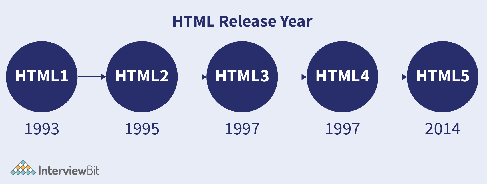

# HTML CSS Interview Questions
### Note

<details>
  <summary> Resources : </summary>
  Resources of HTML Questions:
  
    1. Top 15 HTML Interview questionns.
    2. Programming Hero Interview questions video.                                                                                                                                                                                        |
</details>

### Table of Contents

<details open>
  <summary> Hide/Show Table of contents</summary>

  | No. | Questions                                   |
  | --- | ----------------------------------------------------------------------------------------------------------------------------------------------------------------------------|
  |     | **Core HTML**                                                                                                                                                                                                                   |
| 1  *** | [What are HTML & HTML5 ? Difference between HTML & HTML5. ](#what-is-HTML)                                                                                                                                                                                                 |
| 2  ***  | [What is Semantic in HTML? Why should we use semantic tags  instead of using  div? ](#what-is-Semantic-in-HTML)                                                                                                                                                                                                 |
| 3  ***  | [Difference between HTML element and HTML tag. ](#Difference-between-HTML-element-and-HTML-tag)                                                                                                                                                                                                 |
| 4  ***  | [When to use inline elements & when to use block elements? give example ? ](#When-to-use-inline-elements)                                                                                                                                                                                                 |
</details>


<!--   Answers
================= -->

## Core HTML

1.  ### What is HTML?

    HTML (Hypertext Markup Language) is a standard markup language **used for creating the structure and content of web pages.** 

    HTML is the backbone of the World Wide Web, **providing a way to structure and present information** on the internet.

    It consists of a set of tags and elements like headings, paragraphs, images, links, and other components of a webpage. 

    <details>
      <summary> Definition of HyperText  </summary>
      Hypertext refers to the capability of linking and connecting different pieces of information or documents through hyperlinks, it enables users to navigate between web pages by clicking on text, images, or other elements.
    </details>
    <details>
      <summary> Definition of Markup  </summary>
      Markup in HTML is the use of angle brackets tags (< > </>) to format and structure content for web browsers.
    </details>

    **HTML Versions at a  glance**
    

    ### What is HTML5?
    HTML5 is the **fifth and latest version** of the Hypertext Markup Language (HTML), which is the standard markup language used for creating web pages and web applications.

    It was developed by the World Wide Web Consortium (W3C) and the Web Hypertext Application Technology Working Group (WHATWG)

    HTML5 introduces new elements, attributes, and APIs (Application Programming Interfaces) that enhance the capabilities of web development.
    
    ### HTML vs HTML5  
    - **Simplified Doctype** ===  ``` <!DOCTYPE html>```
    - **Different Meta** === charset, viewport, author
    
        ```jsx
        <meta charset="UTF-8">
        <meta name="viewport" content="width=device-width, initial-scale=1.0">
        <meta name="author" content="John Doe">
        ```
    
    - **New Element tags** like  audio, video, embed, details, datalist, figure, command, canvas (try to know these tags’ short description)
    - **New input tags**: date, datetime-local, datetime, email, month, number, range
    - **More Semantic tags** :   header, nav, main, section, article, aside, footer, em, strong etc.
    - **New terminology**: Semantic 
    

    **[⬆ Back to Top](#table-of-contents)**

    

3.  ### What is Semantic in HTML?
    ### Why should we use semantic tags  instead of using  div??

       [PH Interview video-1](https://www.facebook.com/100070028615565/videos/1666272797114745)

      Semantic means **meaningful**. A semantic tag in HTML is a tag that carries meaning about the structure and content of the web page, providing information about the type of content enclosed within the tags.

      **Why should We use semantic tags in html?**  
      - **Accessibility:** Helps screen readers (individuals with disabilities) and other assistive technologies **(Screen Magnifiers, Braille displays, Speech Recognition Software)** interpret content.
      - **SEO Friendly:** Improves search engine rankings by providing meaningful structure.
      - **Code Readability:** Makes code more **readable and maintainable** for developers.
      - **Consistency:** Promotes a standardized way to structure content for easier collaboration.
      - **Future-Proofing:** Provides a solid foundation for adapting to new technologies and standards.
      
    **[⬆ Back to Top](#table-of-contents)**
    
    
5.  ### Difference between HTML element and HTML tag.

       [PH Interview video-1](https://www.facebook.com/100070028615565/videos/1666272797114745)


    **[⬆ Back to Top](#table-of-contents)**

    

7.  ### When to use inline elements 
    ### & when to use block elements Give Example

      [PH Interview video-1](https://www.facebook.com/100070028615565/videos/1666272797114745)


    **[⬆ Back to Top](#table-of-contents)**


    
